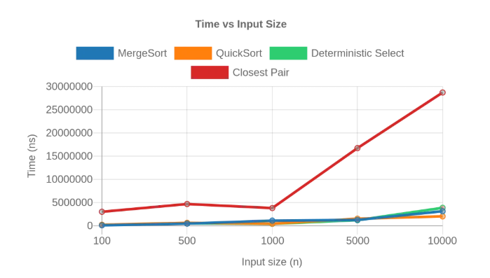
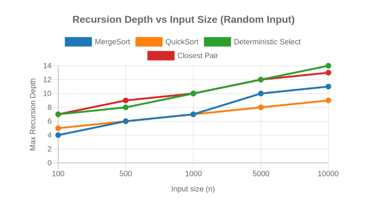
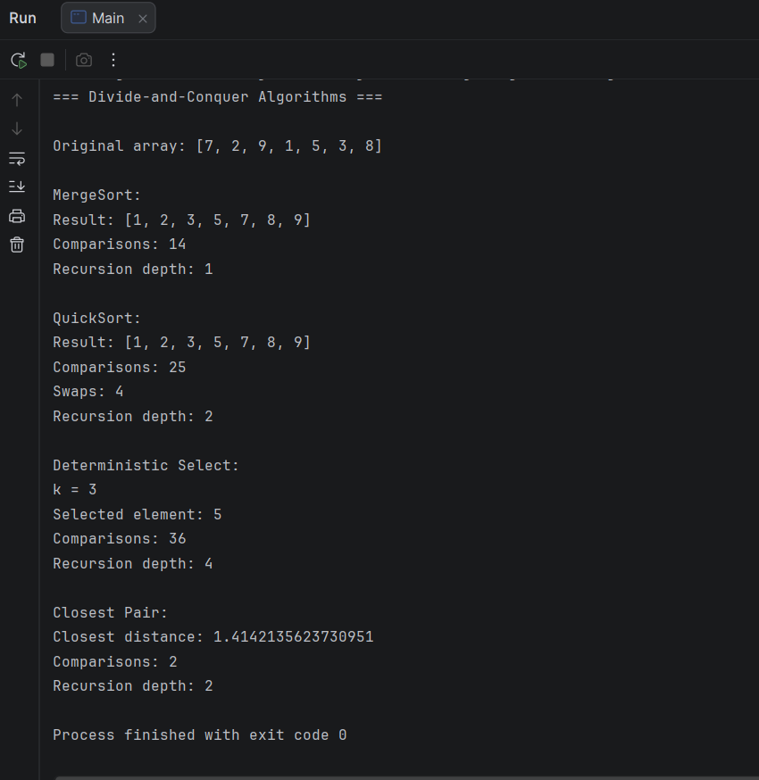
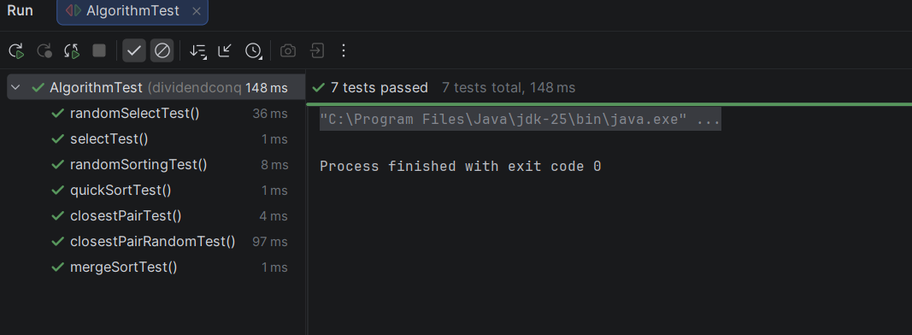

# Assignment 1: Divide-and-Conquer Algorithm Analysis

## A. Project Overview

### Purpose

The purpose of this assignment is to implement and analyze classic divide-and-conquer algorithms. The project focuses on understanding recursive algorithm design, asymptotic complexity, recurrence relations, and practical performance.

The implementation also measures execution time, recursion depth, comparisons, and swaps for different input sizes and input types.

### Implemented Algorithms

The project contains four main algorithms:

* **MergeSort**
* **QuickSort**
* **Deterministic Select (Median-of-Medians)**
* **Closest Pair of Points**

The project also includes correctness tests, performance experiments, CSV result storage, and plots for experimental analysis.

---

## B. Algorithm Analysis

### 1. MergeSort

#### How it works

MergeSort recursively divides the array into two approximately equal halves. Each half is sorted recursively, and then the two sorted halves are merged into one sorted array.

The implementation uses:

* a reusable auxiliary buffer;
* a small-input cutoff of 16 elements;
* Insertion Sort for small subarrays;
* an optimization that skips merging when the two halves are already ordered.

#### Complexity

| Case    | Time       |
| ------- | ---------- |
| Best    | Θ(n log n) |
| Average | Θ(n log n) |
| Worst   | Θ(n log n) |

Space complexity: **O(n)** for the auxiliary array.

#### Recurrence

The main recurrence is:

**T(n) = 2T(n/2) + Θ(n)**

There are two recursive subproblems of size n/2 and a linear-time merge operation.

Using the Master Theorem:

* a = 2
* b = 2
* f(n) = Θ(n)
* n^(log₂2) = n

Therefore:

**T(n) = Θ(n log n)**

The insertion-sort cutoff changes the work for small subarrays but does not change the asymptotic complexity.

---

### 2. QuickSort

#### How it works

QuickSort selects a pivot randomly and partitions the array around the pivot.

The implementation uses:

* randomized pivot selection;
* in-place partitioning;
* recursion only on the smaller partition;
* iteration through the larger partition.

This smaller-first strategy limits the recursion depth even when partitions are unbalanced.

#### Complexity

| Case    | Time       |
| ------- | ---------- |
| Best    | Θ(n log n) |
| Average | Θ(n log n) |
| Worst   | Θ(n²)      |

Space complexity is **O(log n)** for the recursion stack because the algorithm recursively processes the smaller partition and handles the larger partition iteratively.

#### Recurrence

For balanced partitions:

**T(n) = 2T(n/2) + Θ(n)**

Using the Master Theorem gives:

**T(n) = Θ(n log n)**

For a highly unbalanced partition, the recurrence can become:

**T(n) = T(n - 1) + Θ(n)**

which gives:

**T(n) = Θ(n²)**

Randomized pivot selection reduces the chance of repeatedly obtaining very unbalanced partitions.

---

### 3. Deterministic Select (Median-of-Medians)

#### How it works

Deterministic Select finds the k-th smallest element without fully sorting the array.

The implementation:

1. Divides the elements into groups of at most five.
2. Sorts each small group.
3. Takes the median of every group.
4. Recursively finds the median of those medians.
5. Uses it as the pivot.
6. Partitions the array around the pivot.
7. Recursively continues only in the partition containing the required element.

The algorithm modifies the input array in place.

#### Complexity

| Case    | Time |
| ------- | ---- |
| Best    | Θ(n) |
| Average | Θ(n) |
| Worst   | Θ(n) |

Space complexity is **O(log n)** for the recursive call stack.

#### Recurrence and Akra–Bazzi intuition

The recurrence can be described approximately as:

**T(n) ≤ T(n/5) + T(7n/10) + Θ(n)**

The first recursive term finds the median of the medians. The second term represents the largest remaining partition after using the median-of-medians pivot.

The linear work comes from grouping, sorting the small groups, and partitioning.

The recursive parts together remain smaller than the original problem by a constant fraction, so the total work across recursion levels is linear.

Therefore:

**T(n) = Θ(n)**

This deterministic pivot selection is what guarantees linear worst-case performance.

---

### 4. Closest Pair of Points

#### How it works

The Closest Pair algorithm finds the two points with the smallest Euclidean distance.

The implementation:

1. Sorts the points by x-coordinate.
2. Sorts another copy by y-coordinate.
3. Divides the points into two halves.
4. Recursively finds the closest pair in each half.
5. Builds a strip around the dividing line.
6. Checks points in the strip in y-order.

For small subproblems, a brute-force comparison is used.

#### Complexity

| Case    | Time       |
| ------- | ---------- |
| Best    | Θ(n log n) |
| Average | Θ(n log n) |
| Worst   | Θ(n log n) |

Space complexity is **O(n)** because the implementation uses auxiliary arrays and a set during the recursive processing.

#### Recurrence

The main recurrence is:

**T(n) = 2T(n/2) + Θ(n)**

The two recursive calls process the left and right halves. Constructing and checking the strip takes linear time.

By the Master Theorem:

**T(n) = Θ(n log n)**

This is significantly better asymptotically than the O(n²) brute-force approach for large inputs.

---

## C. Experimental Results

### Experimental Setup

The experiments were performed for five input sizes:

* 100
* 500
* 1,000
* 5,000
* 10,000

Four input types were tested:

* random
* sorted
* reverse-sorted
* duplicate-heavy

For each experiment, the program measured:

* execution time using `System.nanoTime()`;
* maximum recursion depth;
* number of comparisons;
* number of swaps for QuickSort.

The results were saved to:

`results/results.csv`

The experiment uses one timing measurement for each algorithm/input combination. Therefore, small timing differences can be affected by JVM warm-up, JIT compilation, system load, and garbage collection.

### Execution Time: Random Input

The following results show the measured execution time for random inputs.

|      n | MergeSort (ns) | QuickSort (ns) | Select (ns) | Closest Pair (ns) |
| -----: | -------------: | -------------: | ----------: | ----------------: |
|    100 |         83,000 |         95,800 |      69,000 |         2,272,000 |
|    500 |        227,600 |        325,400 |     257,100 |         2,357,000 |
|  1,000 |        582,100 |        281,400 |     271,100 |         2,205,000 |
|  5,000 |        705,900 |        690,600 |     691,900 |         8,548,700 |
| 10,000 |      1,256,300 |        999,200 |   2,235,500 |        10,457,300 |

### Recursion Depth: Random Input

|      n | MergeSort | QuickSort | Select | Closest Pair |
| -----: | --------: | --------: | -----: | -----------: |
|    100 |         4 |         4 |      7 |            7 |
|    500 |         6 |         5 |     10 |            9 |
|  1,000 |         7 |         6 |     11 |           10 |
|  5,000 |        10 |         8 |     13 |           12 |
| 10,000 |        11 |         9 |     12 |           13 |

The measured recursion depth generally grows slowly with input size. Small variations are expected because QuickSort uses randomized pivots and the Select implementation has recursive work for pivot selection.

### Results for Different Input Types

The following table shows execution times for n = 10,000.

| Algorithm    |        Random |       Sorted |      Reverse |    Duplicates |
| ------------ | ------------: | -----------: | -----------: | ------------: |
| MergeSort    |  1,256,300 ns |    67,300 ns | 1,401,200 ns |    498,800 ns |
| QuickSort    |    999,200 ns |   561,900 ns |   471,000 ns |    620,100 ns |
| Select       |  2,235,500 ns |   358,300 ns |   231,100 ns |    452,700 ns |
| Closest Pair | 10,457,300 ns | 3,584,200 ns | 3,520,700 ns | 22,982,500 ns |

The complete measurements for all input sizes and types are available in `results/results.csv`.

### Plots

#### Time vs. n

#### Recursion Depth vs. n

---

## D. Discussion

### Do the results match theoretical complexity?

The experimental results generally agree with the expected asymptotic behavior.

MergeSort shows the expected approximately n log n growth. QuickSort also remains relatively efficient because randomized pivot selection and smaller-first recursion prevent excessive recursion depth.

Deterministic Select is expected to have linear worst-case complexity, although the measured execution time is not perfectly linear. Constant factors, recursive pivot selection, and JVM effects influence the actual measurements.

Closest Pair shows much better scalability than a quadratic brute-force solution would have for large inputs. Its execution time grows approximately according to the expected n log n complexity.

The measured values should not be interpreted as exact mathematical curves because each experiment was timed once and real JVM execution contains additional overhead.

### How does input structure affect performance?

Input structure affects the measured performance of the algorithms.

MergeSort is relatively stable because its main divide-and-conquer structure does not depend strongly on the input ordering. However, the implementation includes an optimization that skips merging when the two halves are already ordered, so sorted inputs can be processed faster.

QuickSort is affected by pivot placement and the structure of the input. Randomized pivots reduce dependence on a specific input ordering. Duplicate-heavy inputs also affect partitioning because many values can be equal to the pivot.

Deterministic Select can also show different measured times for different input structures even though its worst-case asymptotic complexity remains linear.

Closest Pair can be noticeably affected by duplicate-heavy inputs because many points may have distance zero, increasing the amount of work in the strip checking.

### Why does smaller-first recursion help QuickSort?

QuickSort recursively processes the smaller partition and handles the larger partition using iteration.

This guarantees that the recursive side becomes smaller at every recursive step. As a result, the recursion stack remains small even if the partition sizes are unbalanced.

Without this strategy, repeatedly recursing into a large partition could produce recursion depth close to O(n) in the worst case.

### Why does Median-of-Medians guarantee O(n)?

Median-of-Medians guarantees that the selected pivot is good enough to discard a constant fraction of the elements after partitioning.

The array is divided into groups of five, and the medians of these groups are used to find a pivot. This prevents the algorithm from repeatedly choosing extremely unbalanced pivots.

The recurrence contains two smaller recursive problems and linear partitioning work:

**T(n) ≤ T(n/5) + T(7n/10) + Θ(n)**

Because the recursive subproblems shrink by constant fractions and the non-recursive work is linear, the total running time is Θ(n).

### Why is divide-and-conquer Closest Pair faster than O(n²) for large inputs?

The brute-force method compares every pair of points, which requires O(n²) comparisons.

The divide-and-conquer algorithm divides the points into two halves and only performs a limited number of comparisons in the strip near the dividing line.

Its recurrence is:

**T(n) = 2T(n/2) + Θ(n)**

which gives **Θ(n log n)**.

For large n, n log n grows much more slowly than n², so the divide-and-conquer approach scales better.

### What practical factors affect performance?

The measured execution time is affected by more than algorithmic complexity.

Important practical factors include:

* JVM warm-up and JIT compilation;
* garbage collection;
* CPU load from other programs;
* memory allocation;
* CPU cache behavior;
* object creation;
* random number generation;
* array copying;
* Java method-call overhead.

For this reason, measured times should be used to observe general trends rather than as exact implementations of theoretical formulas.

---

## E. Reflection

This assignment helped me understand how divide-and-conquer algorithms work not only theoretically but also in actual Java programs. I implemented four different algorithms with different recursion structures and learned how their recurrences lead to their asymptotic complexities. I also learned that theoretical complexity and real execution time are not exactly the same because practical factors such as the JVM, memory access, and garbage collection affect measurements.

The main implementation challenges were handling recursive partitioning correctly, keeping QuickSort recursion under control, implementing the Median-of-Medians pivot selection, and correctly dividing points for the Closest Pair algorithm. Testing was also important because some errors were not visible from the basic examples. Comparing the algorithms with `Arrays.sort()` and using brute force for Closest Pair helped verify that the implementations produced correct results.

---

## F. Screenshots

### Program Output

The following screenshot shows the output of the main program and the results of the implemented algorithms.

### Test Results

The following screenshot shows the JUnit correctness tests.

### Experimental Plots

The project contains two required plots showing the relationship between input size and algorithm performance.

### Results File

The complete experimental data is stored in:

`results/results.csv`

The CSV contains measurements for all four algorithms, five input sizes, and four input types.
